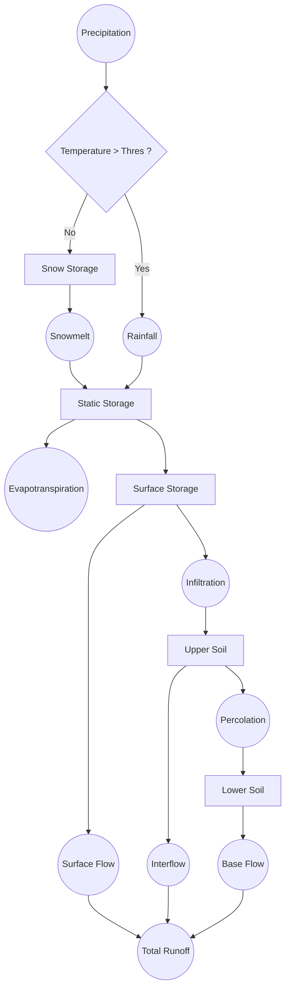

# `model400.py` 

## Description
**`model400.py`**  
Is an implementation of the TETIS model structure (Frances et al 2007), (Quintero & Velasquez 2022).

Francés, F., Vélez, J. I., & Vélez, J. J. (2007). Split-parameter structure for the automatic calibration of distributed hydrological models. Journal of Hydrology, 332(1-2), 226-240.

Quintero, F., & Velásquez, N. (2022). Implementation of TETIS hydrologic model into the hillslope link model framework. Water, 14(17), 2610.

- Uses two forcings: precipitation and evapotranspiration
- Includes snow processes
- Uses constant infiltration and percolation rates
- Estimates three flow components: surface flow, interflow and baseflow
- Tile drainage flow can be represented via interflow
- This formulation includes routing across the river network created by the hillslopes

---

## Inputs

- **Forcings :**
  - Precipitation (P),  in mm/hour  
  - Evapotranspiration (ET), in mm/month
  - Air Temperature (Ta), in C $\degree$

- **Hillslope / channel properties:**
  - **Hillslope area** – contributing surface area draining into the channel, in square kilometers.
  - **Channel accumulated drainage area** – total upstream area contributing to a channel link, in square kilometers.  
  - **Channel length** – physical length of the channel link, in kilometers.  

- **Initial conditions:**
  - Discharge in the channel [m3/s]  
  - SWE in snow storage [m]
  - Water stored in the static storage [m]
  - Water stored in the soil surface [m]
  - Water stored in the upper layer of soil [m]
  - Water stored in the bottom layer of soil [m] 
  

- **Parameter and default values**

    - Channel reference velocity $v_r$=0.3\,m/s
    - Exponent of channel velocity discharge $\lambda_1$ =0.3  (dimensionless)
    - Exponent of channel velocity area $\lambda_2$ =-0.1  (dimensionless)
    - Maximum static storage $H_{u}$ = 100 (mm)
    - Temperature threshold T = 0 $(\degree C) $ 
    - Melting factor MF = 5 $(mm / \degree C / day)$
    - Velocity of water on the hillslope surface $v_h$ =0.1m/s
    - Infiltration rate inf =3$(mm/hr)$
    - Percolation rate  per=2 $(mm/hr)$
    - Residence time in upper soil layer $\alpha_1$ = 10 (day)
    - Residence time in lower soil layer $\alpha_2$ = 100 (day)

    Other parameters used internally in the formulation are
    - Reference area $Ar=1km^2$
    - Reference discharge $q_r=1m^3/s$ 

  

---

## Outputs

- Discharge in the channel [m3/s]  
- Snow Water Equivalent in the snow storage [m]
- Water ponded in the surface [m]
- Water stored in the upper layer of soil [m]
- Water stored in the bottom layer of soil [m] 
- Snowmelt [m3/s]
- Surface Flow [m3/s]
- Interflow [m3/s]
- Baseflow [m3/s]

---

## Equations
In the formulation equations:
- $L$ is the length of the channel
- $A_h$ is the area of the hillslope
- $S_0$ is the snow water equivalent in the snow storage
- $S_1$ is the water stored in the static storage
- $S_2$ is the water ponded in the surface
- $S_3$ is the water stored in the upper layer of soil
- $S_4$ is the water stored in the lower layer of soil
- $q$ is the discharge in the channel. 

**Snow Storage**
$$
\frac{dS_0}{dt}=p-sm
$$
$p$ is the precipitation

$sm$ is the snowmelt
$sm$ = MF * Ta * S_0

**Static Storage**
$$
\frac{dS_1}{dt}=x_1 - x_2-ET_a
$$
$x_1$ is 
$x_2$ is 
$ET_a$ is 

**Surface storage**
$$
\frac{dS_2}{dt}=x_2 - x_3-SF
$$
$x_2$ is 
$x_3$ is 
$SF$ is 

**Upper soil layer**
$$
\frac{dS_3}{dt}=x_3-x_4-IF
$$
$x_3$ is 
$x_4$ is 
$IF$ is 

**Lower soil layer**
$$
\frac{dS_4}{dt}=x_4-BF
$$
$x_4$ is 
$BF$ is 

$q_{ts}$ is the flux of water from the top layer storage to the subsurface is defined by $q_{ts} = k_i\,s_t$ , where $k_i=k_2\beta$

$e_t$ is the evapotranspiration in the top layer of soil


**Subsurface layer:**
   
$$
\frac{ds_s}{dt}=q_{ts}-q_{sc}-e_s
$$

 $q_{sc}$ is the flux of water from the subsurface to the channel is defined by $q_{sc} = k_3\,s_s$   

**Nonlinear channel routing:**

The mass transport equation for each channel link in the network is given by
$$
   \frac{dq}{dt} =L\,\frac{v_{r}}{1-\lambda_1}\,\frac{q}{q_r}^{\lambda_1}\frac{A}{A_r}^{\lambda_2}\,[-q+(q_{pc}+q_{sc})\frac{A_h}{60}+q_{in}] 
$$

where $q_{in}$ is the flux from upstream channels.
 
  
**Appendix**

Fluxes representing evaporation are given by:

$c =(s_p)+(s_t/s_L)+(s_s/(h_b-s_L))$

$e_p=e_{pot}(s_p)/c$

$e_t=e_{pot}(s_t/s_L)/c$

$e_s=e_{pot}(s_s/(h_b-s_L))/c$


---

## Dependencies

- Python ≥3.8  
- `numpy`  
- Internal `ifc_hlm` modules  

---

## Example Usage

```python
from ifc_hlm.models import model254

# Define parameters (see lines 62–73 for parameter set)
params = {
    "hillslope_area": [...],   # km²
    "channel_area": [...],     # km²
    "channel_length": [...],   # km
    "infiltration": {...},
    "routing": {...},
    "initial_state": {...}
}

# Initialize model
hlm = model254.HLMModel(params)

# Forcings in mm/hour
precip = [2.5, 5.0, 0.0, ...]   # precipitation time series
et     = [0.1, 0.1, 0.2, ...]   # evapotranspiration series

# Run model (dt = 1.0 hour)
results = hlm.run(precip, et, dt=1.0)

Qout = results["discharge"]
```


